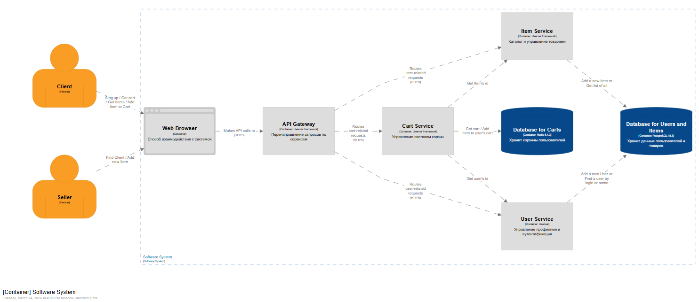
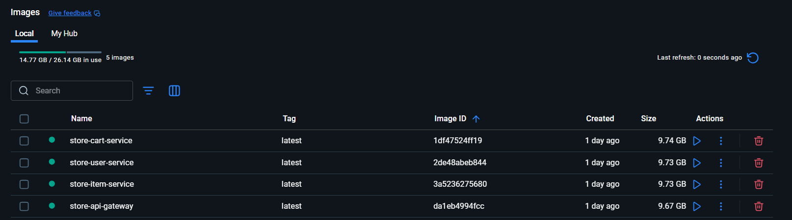

# Store 

REST API микросервисный магазин на C++ userver framework.

> [!NOTE]  
> В дальнейшем уберу папку Lab2-X и сделаю репозиторий, как проект, но пока что так.
## Стек

- **Framework**: [userver](https://userver.tech/)
- **Язык**: C++20
- **Сборка**: CMake
- **Кодогенерация**: Chaotic (генерация DTO)
- **Тестирование**: pytest + userver testsuite
- **Контейнеризация**: Docker + Docker Compose

## ADR
|Index|Tags|Description|
|-----|----|-----------|
|[ADR-001](./decisions/ADR-001.md)|architecture, gateway, auth|API Gateway как единая точка входа|
|[ADR-002](./decisions/ADR-002.md)|auth, security|Session-based аутентификация|
|[ADR-003](./decisions/ADR-003.md)| codegen, dto, chaotic|Chaotic для генерации DTO|

## Архитектура


### Сервисы

| Сервис | Порт | Описание |
|--------|------|----------|
| api-gateway | 8080 | Маршрутизация запросов, аутентификация |
| user-service | 8081 | Регистрация, логин, управление пользователями |
| item-service | 8082 | Каталог товаров |
| cart-service | 8083 | Корзина пользователя |

## Схема базы данных MongoDB
Схема и правила валидации находятся в [`mongo/01_validation.js`](/mongo/01_validation.js), тестовые данные — в [`mongo/02_data.js`](/mongo/02_data.js). Данные загружаются при запуске Dev Container.

Обоснование структуры документов приведено в [`Lab4/schema_design.md`](/Lab4/schema_design.md).
### Коллекции
| Коллекция | Описание | Тип связи | 
|--------|----------|---------|
| items | Каталог товаров (название, описание, цена, остаток)| Самостоятельная сущность|
|carts|Корзины пользователей| Содержат вложенный массив товаровEmbedded (вложенные документы)|

### Структура документов и связи
Вместо отдельной таблицы cart_items, позиции корзины хранятся внутри документа пользователя в массиве items.
- carts.user_id → Ссылка на users.id из PostgreSQL (логическая связь).
- carts.items[].item_id → Ссылка на items._id в MongoDB (References).
- carts.items[].quantity → Количество конкретного товара в корзине.

## Схема базы данных Postgresql

Схема находится в [`postgresql/schemas/01_schema.sql`](/postgresql/schemas/01_schema.sql), тестовые данные — в [`02_data.sql`](/postgresql/schemas/02_data.sql). 

### Таблицы

| Таблица | Описание |
|---------|----------|
| users | Пользователи системы (покупатели и продавцы) |
| items | Каталог товаров |
| tokens | Сессионные токены авторизации |
| cart_items | Позиции в корзинах пользователей |

### Связи

- tokens.user_id → users.id - токен принадлежит пользователю
- cart_items.user_id → users.id - корзина принадлежит пользователю  
- cart_items.item_id → items.id - позиция корзины ссылается на товар

### Индексы

| Индекс | Таблица | Назначение |
|--------|---------|------------|
| idx_users_name | users(name text_pattern_ops) | Поиск по маске имени (`LIKE 'Ivan%'`) |
| idx_tokens_user_id | tokens(user_id) | Поиск токенов пользователя при валидации |

Не делал индексы с другими таблицами, так как думаю, что возможно из-за следующих лабораторных работ, они могут стать ненужными.
## Быстрый старт

### Требования

- Docker Desktop
- Docker Compose

### Запуск микросервисов
#### Docker Compose
```bash
git clone <ссылка на репозиторий>
cd Lab2/store
docker-compose up --build
```
> [!IMPORTANT]  
> Такой запуск потребует много оперативной памяти, поэтому лучше использовать `Dev Container`.



#### Dev Container
Каждый микросервис запустить вот такой командой внутри определенной папки (например, user-service):
```bash
cd store/user-service
mkdir -p build && cd build
cmake ..
cd .. && ./build/user-service --config ./configs/config.yaml 
```
### Проверка доступности сервера
```bash
curl http://localhost:8080/ping
```

## API

Полная документация: [`openapi.yaml`](./openapi.yaml)

Swagger UI не использовался, но использовался Postman.

### Аутентификация
```bash
# Регистрация
curl -X POST http://localhost:8080/users/register \
  -H "Content-Type: application/json" \
  -d '{"username": "pavel", "password": "123", "name": "Pavel", "role": "client"}'

# Логинимся и получаем токен
curl -X POST http://localhost:8080/users/login \
  -H "Content-Type: application/json" \
  -d '{"username": "pavel", "password": "123"}'
```

### Товары
```bash
# Получить список (нужен токен)
curl http://localhost:8080/items \
  -H "Authorization: Bearer <token>"

# Создать товар (только для seller)
curl -X POST http://localhost:8080/items \
  -H "Authorization: Bearer <token>" \
  -H "Content-Type: application/json" \
  -d '{"name": "Laptop", "price": 999.99, "quantity": 10}'
```

### Корзина
```bash
# Добавить товар
curl -X POST http://localhost:8080/cart \
  -H "Authorization: Bearer <token>" \
  -H "Content-Type: application/json" \
  -d '{"item_id": 1, "quantity": 2}'

# Посмотреть корзину
curl http://localhost:8080/cart \
  -H "Authorization: Bearer <token>"
```

## Роли

| Роль | Права |
|------|-------|
| client | Просмотр товаров, управление корзиной |
| seller | Всё выше + создание/изменение/удаление товаров |

## Структура проекта
```
content/                  # Картиночки
decisions/                # ADR
store/                    # Сам сервис
├── api-gateway/          # Маршрутизация и аутентификация
│   ├── configs/          # Конфигурация
│   ├── src/handlers/     # HTTP хендлеры
│   └── tests/            # Функциональные тесты
├── cart-service/         # Корзина
│   ├── configs/          # Конфигурация
│   ├── src/    
│   │   ├── handlers/     # HTTP хендлеры
│   │   └── storage/      # in-memory хранилище
│   ├── schemas/          # Схемы
│   └── tests/            # Функциональные тесты
├── item-service/         # Каталог товаров
│   ├── configs/          # Конфигурация
│   ├── src/    
│   │   ├── handlers/     # HTTP хендлеры
│   │   └── storage/      # in-memory хранилище
│   ├── schemas/          # Схемы
│   └── tests/            # Функциональные тесты
├── user-service/         # Пользователи и токены
│   ├── configs/          # Конфигурация
│   ├── src/    
│   │   ├── handlers/     # HTTP хендлеры
│   │   └── storage/      # in-memory хранилище
│   ├── schemas/          # Схемы
│   └── tests/            # Функциональные тесты
├── docker-compose.yaml
├── openapi.yaml          # API документация
```

## Тестирование

Каждый сервис имеет функциональные тесты на pytest через userver testsuite. Один из примеров тестирования:
```bash
cd user-service/build
ctest -V
```